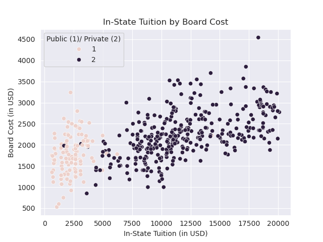
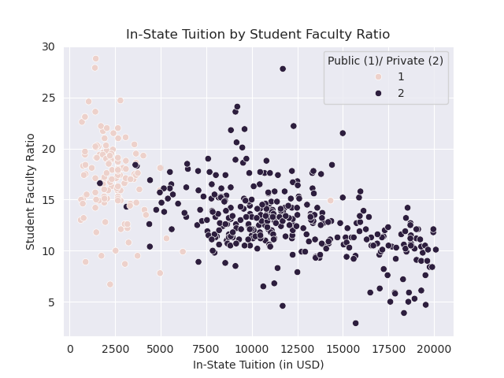

# Higher Education Consulting Analytics: The Factors That Affect Graduation Rates
## Project Purpose
The purpose of this project is to develop a model which can predict the cost of in-state tuition for a school in the USA based on a couple of factors.
## Data Dictionary
```
College Name: The full name of that specific university 
State: The US state that the university is in
Public (1)/ Private (2): wether the school is public or private, represented by a number 1 or 2  
appli. rec'd: The amount of applications that a university received            
# appl. accepted: The amount of applications that a university accepted          
# new stud. enrolled: The amount of new students that a unversity accepted      
% new stud. from top 10%: A percentage of the amount of new students that university received if that student was from the top 10 percent in highschool
% new stud. from top 25%: A percentage of the amount of new students that university received if that student was from the top 25 percent in highschool 
# FT undergrad: The amount of Full Time Undergrads that the school has           
# PT undergrad: The amount of Part Timr undergrads that the school has           
in-state tuition: The cost of that schools in-state tuition
out-of-state tuition: The cost of that schools out-of-state tuition      
room: The cost of a dorm room for that school                     
board: The cost of trhe meal plan for that school              
add. fees: The cost of any additional fees that that school has              
estim. book costs: an estimate of the cost for books for that school      
estim. personal $: an estimate of the cost for personal items for that student       
% fac. w/PHD: the percentage of faculty at that school that has a doctorate           
stud./fac. ratio: The ratio of studenbts for every faculty member at that school        
Graduation rate: The graduation rate at that school       
Public or Private: Tells wether a school is poublic or private, but as a string	
total cost (in state tuition): The total estimated cost of a student, if they paid for everything along with their in state tuition	for that school
total cost (out of state tuition):	The total estimated cost of a student, if they paid for everything along with their out of state tuition for that school	
Mean Tuition: The average tuition between in state tuition and out of state tuition for that school
```
## Summary
### Handling NaN Values and Outliers
- I handled NaN values by...
1. dropping them, I didn't want synthetic data to manipulate the performance of my model
**EX:**
```python
#1: dropping all the na values and saving them in a variable
sub = df.dropna()
#2: turning that subset into a csv with `to_csv`
sub.to_csv('data/cleaned_universities.csv')
```
**important to convert to a csv for later ease of use.**
### key visuals
#### 1. A heatmap of Correlations of In-State Tuition


**a heatmap which shows the correlations between different numerical columns, this was helpful when it came to selecting features in order to create the model**
#### 2. A Scatterplot of Tuition and Board Costs
 

**a scatterplot that shows the cost of in-state tuition by the board cost, and they are grouped by wether the school is public or private. shows us that public schools have lower in-state tuition costs than private schools, but the cost betwen the Board isn't to different between public and private schools (private schools do however appear to have a higher board cost on average compared to public schools)**
#### 3. A Scatterplot of Tuition and Student Faculty Ratio's
 

**A Scatterplot showing the cost of in-state tuition by the student faculty ratio, and they are grouped by wether the school is public or private. Shows us that schools with higher student faculty ratio's tend to have lower in-state tuition costs. also private schools seem to have lower student facult ratio's then public schools (but there are some outliers)**
## Model Performance
### Feature Selection
**I decided to chose these features...**
1. Public (1)/ Private (2)
2. board
3. Graduation rate
4. % new stud. from top 10%
5. % new stud. from top 25%
6. room
7. stud./fac. ratio

I chose them as they correlated strongly with the target variable (In-State Tuition) with about being *HEAVILY* related (Like the out-of-state tuition).
### Model Selection
**I chose several models...**
1. Linear Regression
2. Decission Tree Regressor
3. Random Forest Regressor
4. K Nearest Neighbors Regressor

**chose these because i'm used to using them**
### Evaluation Metrics

| Model             | RMSE     | R²       |MAPE|
|-------------------|----------|----------|------|
| Linear Regressor |1802.64$|89.551%|26.774%|
|Decission Tree Regressor|2612.58$|78.051%|33.512%|
|Random Forest Regressor|1809.52$|89.558%|23.016%|
|K Nearest Neighbor Regressor|1864.03$|87.077%|63.990%|
### pickling
I chose to pickle the random forest model as it had the best R squared score and the best MAPE score. while its rmse was worse then linear regression, it wasn't worse by much, which ads to the reason as to why I chose the randome forest model to pickle
## conclusion
#### my analysis was able to create a model that is effecctive at developing predictions, it could be used to...
1. forecast the price of future higher eduaction projects
2. be used to estimate future prices of pre-existing schools by plugging in projected values